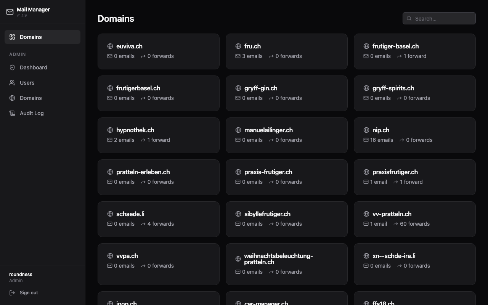
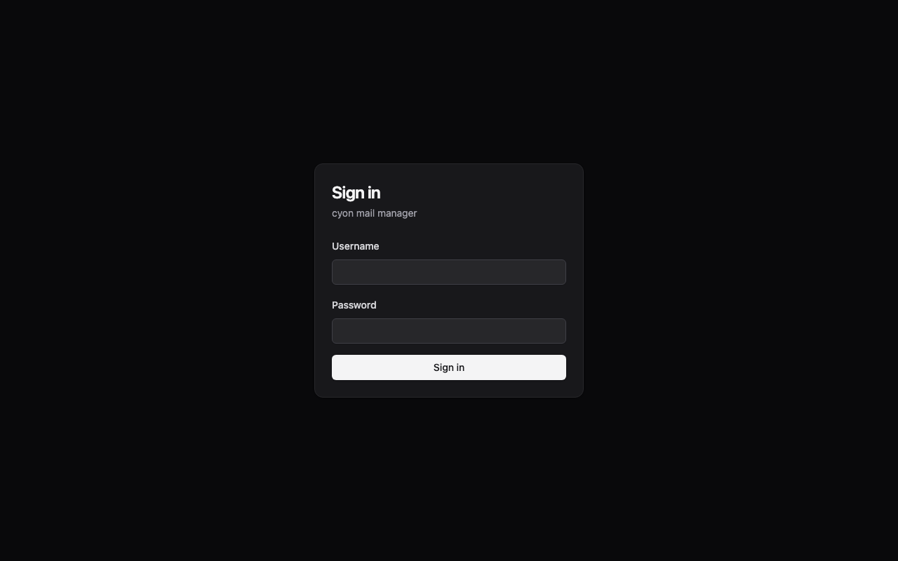
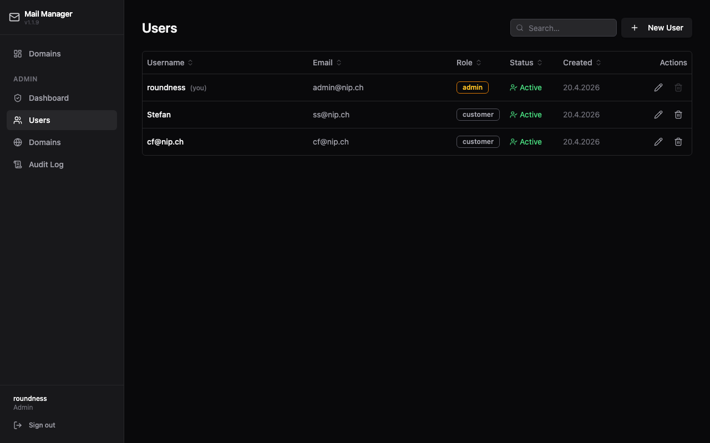
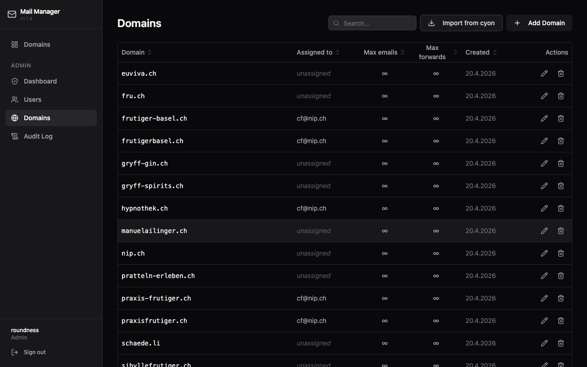
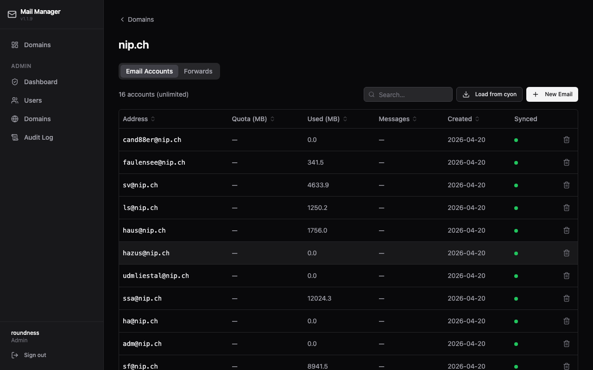
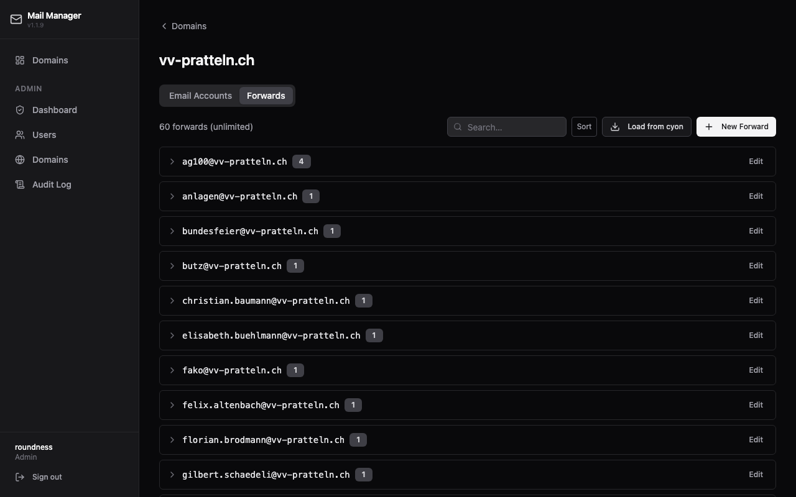

# cyon Mail Manager

Self-hosted web app for managing email addresses and forwards on [cyon.ch](https://cyon.ch) hosting. Assign domains to customers; customers manage their own email accounts and forwards without needing cPanel access.



## What It Does

- **Admin** creates customer accounts, assigns cyon domains to them, and triggers sync with cyon servers
- **Customers** create and delete email accounts and forwards for their assigned domains
- All changes are applied live to cyon via SSH + cPanel UAPI — no manual cPanel access needed
- Full audit log of every action

## Screenshots

<table>
<tr>
<td><br><sub>Login</sub></td>
<td><br><sub>User management</sub></td>
</tr>
<tr>
<td><br><sub>Domain management</sub></td>
<td><br><sub>Audit log</sub></td>
</tr>
<tr>
<td><br><sub>Domain — Email Accounts tab</sub></td>
<td><br><sub>Domain — Forwards tab</sub></td>
</tr>
</table>

## Stack

| Layer | Technology |
|-------|-----------|
| Backend | Python 3.12 + FastAPI |
| Database | SQLite (`/data/app.db`) |
| Auth | JWT (24h tokens) + bcrypt |
| cyon bridge | Paramiko SSH → cPanel UAPI |
| Frontend | React 18 + TypeScript + Vite + Tailwind CSS + shadcn/ui |
| Container | Single Docker image, docker-compose |

FastAPI serves both the REST API (`/api/*`) and the React SPA on the same port (8000).

## Quick Start

### Prerequisites

- Docker + docker-compose
- SSH access to your cyon account (ed25519 key)
- A cyon domain with cPanel email enabled

### Setup

1. **Clone the repo:**
   ```bash
   git clone https://github.com/youruser/cyon-mail-manager.git
   cd cyon-mail-manager
   ```

2. **Create the data directory and place your SSH key:**
   ```bash
   mkdir -p data/ssh
   cp ~/.ssh/id_ed25519 data/ssh/id_ed25519
   chmod 600 data/ssh/id_ed25519
   ```

3. **Create `.env`:**
   ```env
   SECRET_KEY=change-me-to-a-long-random-string
   ADMIN_USERNAME=admin
   ADMIN_PASSWORD=change-me
   ADMIN_EMAIL=admin@example.com
   CYON_SSH_HOST=s075.cyon.net
   CYON_SSH_USER=your-cyon-username
   CYON_SSH_KEY_PATH=/data/ssh/id_ed25519
   ```

4. **Start:**
   ```bash
   docker-compose up -d
   ```

5. **Open** `http://localhost:8080` and log in with your admin credentials.

On first start, Alembic runs migrations and the admin account is created automatically from the env vars.

## Roles & Permissions

| Action | Admin | Customer |
|--------|-------|----------|
| Create/manage customer accounts | ✓ | |
| Assign domains to customers | ✓ | |
| View audit log, trigger sync | ✓ | |
| View own domains | ✓ | ✓ |
| Create/delete email accounts on own domains | ✓ | ✓ |
| Create/delete email forwards on own domains | ✓ | ✓ |

Domain access is enforced server-side on every request — customers cannot access domains they don't own.

## Development

### Backend

```bash
cd app/backend
python -m venv .venv && source .venv/bin/activate
pip install -r requirements.txt
alembic upgrade head
uvicorn app.main:app --reload --port 8000
```

### Frontend

```bash
cd app/frontend
npm install
npm run dev   # proxies /api to localhost:8000
```

### Running tests

```bash
cd app/backend
pytest
```

## Architecture

```
Browser → FastAPI ┬─ /api/*  → route handlers → SQLAlchemy → SQLite
                  └─ /*      → React SPA (static files)
                                └─ CyonService → SSH → cyon server
Volume /data: app.db + ssh/id_ed25519
```

## Docker

Multi-stage build: `node:20-alpine` compiles the frontend, then `python:3.12-slim` serves everything. Single container, single port.

```bash
docker-compose build
docker-compose up -d
docker-compose logs -f
```

## License

MIT
